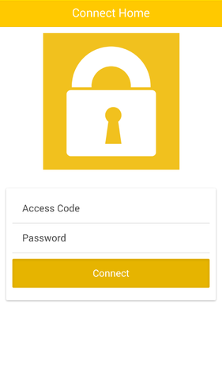
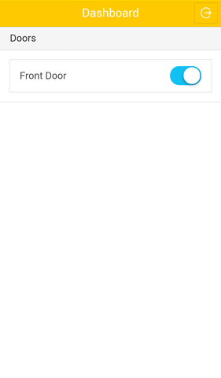

# doorkit-mobile

As a component of doorkit, connect to home through [doorkit-server](https://github.com/tianhsky/doorkit-server), and emit instructions to [doorkit-broker](https://github.com/tianhsky/doorkit-broker).

## Screenshots

## See Also

* [doorkit-broker](https://github.com/tianhsky/doorkit-broker), for raspberry-pi broker component.
* [doorkit-server](https://github.com/tianhsky/doorkit-server), for server component.

## Author

Tianyu Huang